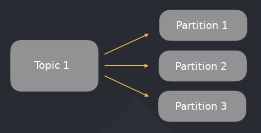

# full-cycle-2.0-kafka

Files I produced during the Apache Kafka classes of my [Microservices Full Cycle 2.0 course](https://drive.google.com/file/d/1MdN-qK_8Pfg6YI3TSfSa5_2-FHmqGxEP/view?usp=sharing).

# Theory

## Kafka basic functioning

## Topics

Usually you will want to have the topic partitions inside different brokers. So you can imagine that the partitions 1, 2 and 3 are in different machines. If one machine dies, you have 2/3 of the messages of this topic in other brokers.

You can also choose to duplicate the partitions and distribute them along all brokers using Replication Factor = 2. In this way, if one broker dies, you will have the same partition in another one.

## Partitions

Each topic has associated partitions. Kafka saves messages sequentially to disk!

